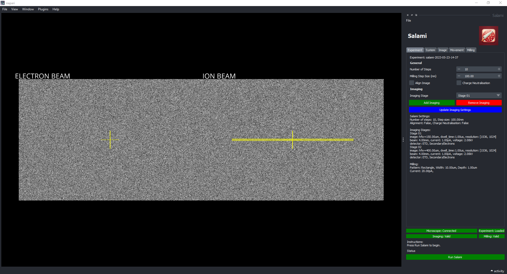

# salami
salami is a python package for volume electron microscopy


NB: this package is currently under development.

## Overview

Salami is a python package for volume electron microscopy. It is built on top of OpenFIBSEM and provides a user interface for segmentation and visualization. Salami is designed to be modular and extensible.

Salami currently supports:
- Multi imaging stages
- Milling operation
- Electron beam alignment
- Charge neutralisation




## Getting Started

1. Install OpenFIBSEM (https://github.com/DeMarcoLab/fibsem)

2. Clone this repo.

3. Install Salami
```
$ cd salami
$ pip install -e.
```

4. Run Salami
```
$ salami_ui
```

Once the UI opens, follow the instructions to get started.

## Experimental

Analysis tools are available in the denoise branch. This is experimental and not yet ready for general use. 

Automated denoising and segmentation is available in the denoise branch. This is experimental and not yet ready for general use.
